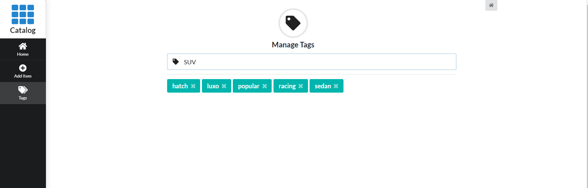

## This app is part of a blog post on how to create a react client consuming data using graphql from a node server.

Generic catalog application that allows you to create items, tagging and rating them.

Technologies/libs used:

 - Server
	 - Node
	 - Express
	 - Apollo Server
	 - Sequelize
 - Client
	 - React (using hooks most of the time)
	 - Apollo Client
	 - Semantic UI

### Getting Started

 1. Clone the repo
 2. [Server] Create an .env file inside the `/server` folder.  These config are loaded at the `config.js`

    PORT={SERVER_PORT} (or leave blank for default 3002)
    CORS_ORIGIN={CLIENT_HOST} (leave blank for default http://localhost:3000)
    DB_DATABASE={database}
    DB_USERNAME={dbusername}
    DB_PASSWORD={dbpassword}
    DB_HOST={host}
    DB_DIALECT={dialect} (mysql | postgres | mssql)
 3. [Server] Run `npm start` inside the server folder to start the server. Check http://localhost:{PORT}/graphql to enter the graphql playground.
 4. [Client] Configure .env to client (not implemented yet)
 5. [Client] Run `npm start` inside `/client` folder

 Screens:

Start server and client.

Featured and Favorite items.

Items can be filtered by name or by tags.

Create Item form.

Manage tag page where the user can view, create and delete tags.

Draft of react components hierarchy